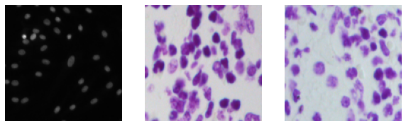
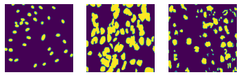
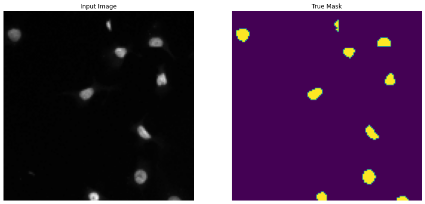
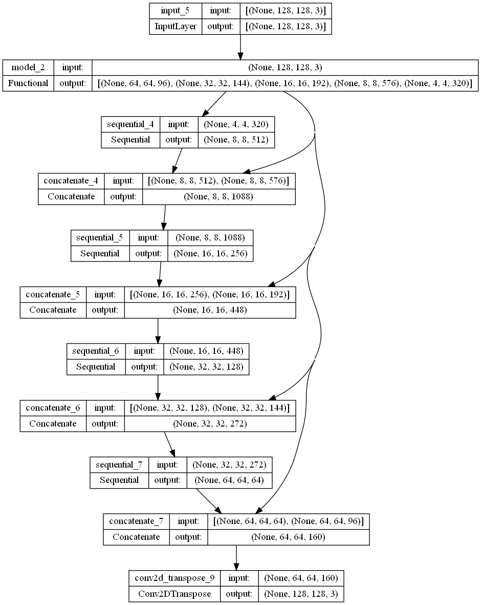
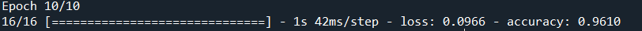
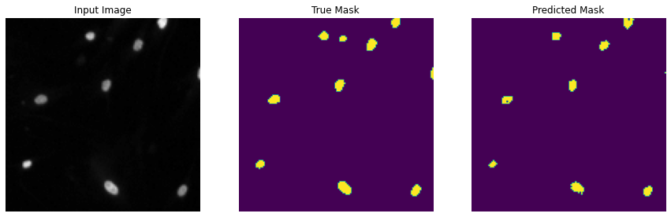
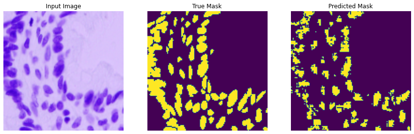
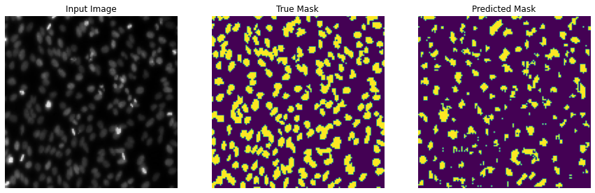

# Nuclei Semantic Segmentation using TensorFlow (ResNet50)

## 1. Summary
The aim of this project is to create a model that can perform image segmentation on images containing cell nuclei (Data Science Bowl 2018).

## 2. IDE and Frameworks used
The project is built using the Spyder and Visual Studio Code IDEs for the python (.py) and jupyter notebook (.ipynb) respectively.

The python packages used in this project is [TensorFlow](tensorflow.org) [Keras](https://keras.io/about/), [Matplotlib](https://matplotlib.org/) and [NumPy](https://numpy.org/).

## 3. Methodology

### 3.1 About the Dataset

The dataset contains 2 folders of images of cell nuclei which images and masks as the inputs and labels respectively. 

Each folder has 670 images with a total of 1340 images with 256 x 256 pixels. The [dataset](https://www.kaggle.com/c/data-science-bowl-2018) was obtained from Kaggle. The sample of the training datasets are shown below:

Images

Masks

Input Image and True Mask side-by-side

### 3.2 Data Pipeline
From the dataset, the training and test data set is split into an 80:20 ratio. I also resized the images to 128 x 128 x 3 (3 represents the number of channels in a RGB image).

In the data augmentation layer, transformations are applied the training images using horizontal and vertical flipping to expose the model to different aspects of the training images and reduce overfitting   .          

To construct the U-Net model, I created a base model from MobileNetV2 and excluded the top layer for classification layer. I also used pix2pix as the upsampling path and froze the downsampling path before compiling and training.

In the classification layer, I applied a global average pooling layer and a Dense layer of 2 outputs (2 class - 'Negative' and 'Positive') and softmax as the activation function.

### 3.3 Model Structure
For this project, I used MobileNetV2 as the encoder for the U-Net due lightweight and fast model. The structure of the image segmentation model is as shown below:

The model was trained with a batch size of 32 and for 10 epochs and ended with a training accuracy of 96.1% as shown in the image below:

## 4. Model evaluation
With test images, the model obtained the following results during model inference:

# License
Distributed under GNU General Public License v3.0. See [LICENSE](LICENSE) for more information.

## Acknowledgements
-  [TensorFlow - Image Classification](https://www.tensorflow.org/tutorials/images/classification)
-  [MobileNetV2 vs ResNet50](https://analyticsindiamag.com/mobilenet-vs-resnet50-two-cnn-transfer-learning-light-frameworks/#:~:text=As%20we%20can%20see%20in,accuracy%2065%25%20in%20100%20epochs.)
-  Kah Chun Kong - SHRDC Technical Instructor 